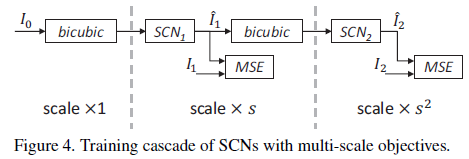

## Short introduction
Sparse coding and deep learning
## Main contributions
- combine sparse coding and deep learning
- using network cascading
- conduct a subjective evaluation
## Architecture
### Overall

### Cascade with mnulti-scale objectives

### Loss
- MSE
- Loss function:

### Training strategy

## Experiments
- Dataset: 91
- Evaluation metric: PSNR
- Patchsie: input 56 × 56 output 44 X 44
- Dict: sparse coding, LR: 9X9 HR: 5 X 5
- SGD

## Final summary
### Pros:
- Combine sparse coding with deep learning as guidiance

### Cons:
- 
### Tips:
- Multi-scale objectives

