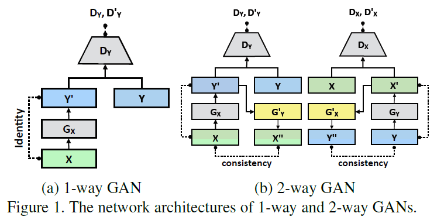
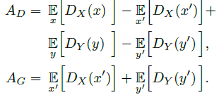

## Short introduction
Training to mimic the professional PS skills
## Main contributions
- Augment U-Net with global features
- Improve WGAN with an adaptive weighting scheme
- Propose individual batch normalization layers for generators (better adjusting to distributions of different domains)
## Architecture
### Two-way GAN
contains a forward mapping and backward mapping and check the consistency.

### Gen and Disc

### Loss
- L2
- Loss function:
Gen Loss:

Cycle consistency loss:

Adversarial losses:

Gradient penalty P:

### Training strategy

## Experiments
- Dataset: MIT-Adobe 5K
  2250 image with retouched version for supervison training
  The other 2250 retouched image for target domain, untouched image of the first partition used as source domain
- Evaluation metric: 
- Patchsie: 512 × 512

## Final summary
### Pros:
- Global feature on Unet
- Two-way GAN with individual BN
### Cons:
- 
### Tips:
- WGAN uses the earth mover distance to measure the distance between the data distribution and the model distribution and significantly improves training stability.
- Instead of weight clipping, panalize the norm of the gradient of the discrimiator with respect to the input
- Detail comparision between different GAN models. Detailing paramenter tuning instructions
