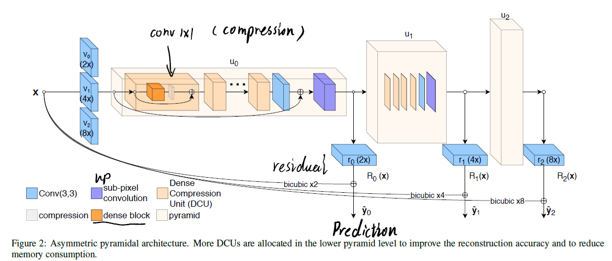

## Short introduction
ranks 2nd in terms of SSIM and 4th in terms of PSNR in the NTIRE2018 SISR challenge, runs 5 times faster than other submissions
## Main contributions
- progressive training
- Generate and discriminate loss at different scales
## Architecture
Dense compression unints

Discriminator

ProSR

### Loss
- Three loss functions at each scale (X2, X4, X8) providing a form of intermediate supervision.
- Using perceptual loss (vgg16: pool2, pool4).
- Discriminator loss: least square loss on residual part (gt: difference between image and bicubic upsampled image)
Los function:

### Training strategy
- Starts by training only the 2× portion of the network
- we incrementally add training pairs of the next scale
- randomly select one of the scales s to avoid mixing batch statistics
## Experiments
- Dataset: DIV2k
- Evaluation metric: 
- Patchsie: 48 × 48, 40 × 40, 32 × 32 for upsample ratio 2×, 4× and 8× respectively
- Adam, learning rate 0.0001, 40 epochs, 0.9, 0.999 momentum

## Final summary
### Pros:
- 
### Cons:
- 
### Tips:
- Do not downsample the groundtruth to create labels,This avoids artifacts that may result from subsampling.

